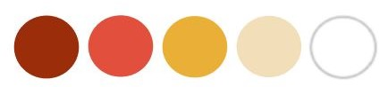
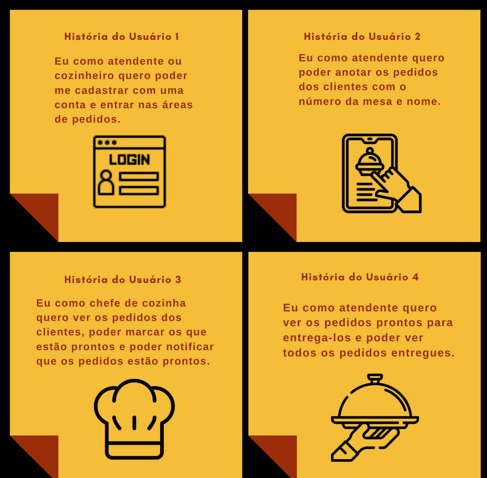

# Boteco Burger :hamburger:

## Índice

- [1. Proposta do Projeto](#proposta-do-produto)
- [2. Definição do Produto](#definição-do-produto)
- [3. A aplicação](#aplicacao)
- [4. Planejamento](#planejamento)
- [5. Histórias de Usuários](#histórias-de-usuários)
- [6. Protótipos](#art-protótipos)
- [7. UI e UX](#UI-UX)
- [8. Tecnologias Utilizadas](#robot-tecnologias-utilizadas)
- [9. Sobre as desenvolvedoras](#desenvolvedoras)

---

## 1. Proposta do Projeto
Um pequeno restaurante de hambúrgueres, que está crescendo, necessita uma interface em que se possa realizar pedidos utilizando um tablet, e enviá-los para a cozinha para que sejam preparados de forma ordenada e eficiente.

Este projeto tem duas áreas: interface (cliente) e API (servidor). Nosso cliente nos pediu para desenvolver uma interface que se integre com a API que outra equipe de desenvolvedoras está trabalhando simultaneamente.

## 2. Definição do Produto
**_Boteco Burguer_** A partir de uma pesquisa com amigos e voluntários praticantes de uma vida boémia, entendemos que os consumidores buscam por boas experiências. Pensando na experiência de cada cliente e funcionários, desenvolvemos um produto para facilitar a vida do atendente que necessita lidar com os pedidos de cada cliente. O garçom anota os pedidos, envia para a cozinha, a cozinha marca os pedidos finalizados que retorna para o salão, o garçom consegue clicar como finalizado e ver todos os pedidos enviados.

 
<h4> Você pode acessar a aplicação <a href="">clicando aqui</a> e utilizar um dos logins de teste abaixo:</h4>

  
  
  
> |      |          Salão          |      Cozinha            |
> |------|-------------------------|-------------------------|
> |  📨  |     salao@brumag.com    |    cozinha@brumag.com	 |
> |  🔐  |         123456          |         123456          |

  
## 3. A aplicação

## 4. Planejamento
Entendemos que o Planejamento é a alma de um projeto, no mapa mental separamos entre rotas públicas e privadas.

 

## 6. Protótipos 

### Paleta de cores

 

---

  
   
 
<!--   
   
    -->

## 5. Histórias de Usuários

  

 

  
<!-- 
- [5. Histórias de Usuários](#histórias-de-usuários)

- [7. UI e UX](#UI-UX)
- [8. Tecnologias Utilizadas](#robot-tecnologias-utilizadas)
- [9. Sobre as desenvolvedoras](#desenvolvedoras) -->

7.UI e UX
Principais objetivos de UI:
Leitura clara de todos os textos

Consistência e padrões para não confundir os usuários

Design minimalista

Navegação intuitiva

Responsivo em tablets

Liberdade e controle do usuário

Principal objetivos de UX:
Ouvir os usuários e compreender como está a sua experiência com a aplicação.

Fizemos uma pesquisa com os usuários para sabermos as opiniões sobre a usabilidade, layout e funcionalidades da aplicação e identificar as possíveis melhorias que poderíamos fazer.
Manter a interface e o estado sincronizados com React
Ser um SPA (Single Page App)
Ser responsivo em tablets
Definir a estrutura de pastas e arquivos
Usar JavaScript (ES6+) para a lógica do projeto
