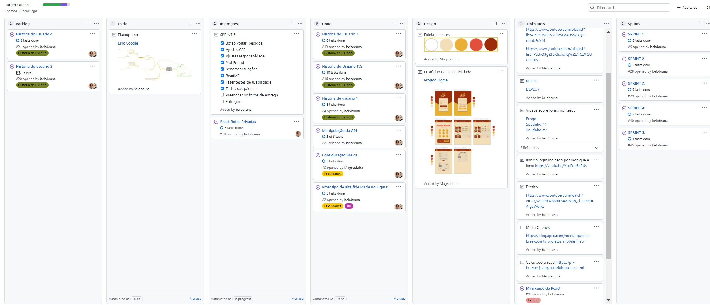

# Boteco Burger :hamburger:

## Índice

- [1. Proposta do Projeto](#proposta-do-produto)
- [2. Definição do Produto](#definição-do-produto)
- [3. A aplicação](#aplicacao)
   * [3.2 Como Funciona?](#como-funciona?)
- [4. Planejamento](#planejamento)
- [5. Histórias de Usuários](#histórias-de-usuários)
   * [5.2 Funcionalidades](#funcionálidades)
- [6. Protótipos](#art-protótipos)
- [7. Tecnologias Utilizadas](#robot-tecnologias-utilizadas)
- [8. Sobre as desenvolvedoras](#desenvolvedoras)

---

## 1. Proposta do Projeto
Um pequeno restaurante de hambúrgueres, que está crescendo, necessita uma interface em que se possa realizar pedidos utilizando um tablet, e enviá-los para a cozinha para que sejam preparados de forma ordenada e eficiente.

Este projeto tem duas áreas: interface (cliente) e API (servidor). Nosso cliente nos pediu para desenvolver uma interface que se integre com a API que outra equipe de desenvolvedoras está trabalhando simultaneamente.

## 2. Definição do Produto
**_Boteco Burguer_** nasceu a partir de uma pesquisa com amigos e voluntários praticantes de uma vida boémia, entendemos que os consumidores buscam por boas experiências. Pensando nisso, desenvolvemos um produto para facilitar a vida do atendente que necessita lidar com os pedidos de cada cliente. O garçom anota os pedidos, envia para a cozinha, a cozinha marca os pedidos finalizados que retorna para o salão, o garçom consegue clicar como finalizado e ver todos os pedidos enviados.

 
 

<h4> Você pode acessar a aplicação <a href="https://boteco-burger.vercel.app/">clicando aqui</a> e utilizar um dos logins de teste abaixo:</h4>

  
 |      |          Salão          |      Cozinha            |
 |------|-------------------------|-------------------------|
 |  📨  |     salao@boteco.com    |    cozinha@boteco.com	 |
 |  🔐  |         123456          |         123456          |

  

  
## 3. A aplicação

  
   
  

  
   
  

  
   
  

 ### 3.2 Como funciona?
Nos Gif mostra um pouco as funcionalidades como:

- Cadastro e Login do usuário;
- Rota direcionada para o setor cadastrado;
- Seleção dos produtos que aparecem diretamente na comanda;
- Selecionar mesa e anotar o nome do cliente;
- Envio dos produtos para a cozinha;
- Pedidos chegam na cozinha, o cozinheiro consegue enviar os pedidos como pronto para o atendente.
- O atendente consegue marcar os pedidos como entregue para o cliente;
- O atendente consegue ver o histórico de pedidos entregues.

## 4. Planejamento
Entendemos que o Planejamento é a alma de um projeto, no mapa mental separamos entre rotas públicas, privadas com cada funcionalidade separado.
Utilizamos o Git Hub Projects como ferramente de planejamento.

Dessa forma, definimos:

- Produto viável mínimo [MVP](https://pt.wikipedia.org/wiki/Produto_vi%C3%A1vel_m%C3%ADnimo)

- Critérios mínimos de aceitação

- Divisão de tarefas

- Para *merge* no repositório (*main*), somente após [*code review*](https://en.wikipedia.org/wiki/Code_review) para revisão em pares e aprovação da *reviewer*

- [Daily Scrum](https://www.desenvolvimentoagil.com.br/scrum/daily_scrum)

  
   
  
   
 

---

## 5. Histórias de Usuários

  
   
 

 ### 5.2 Funcionalidades
 
 Para ser entregue a melhor experiência para o úsuário, a usabilidade foi uma prioridade nesse produto, nos preocupamos com cada funcionalidade equilibrando com uma interface intuitiva.
 Com base nas histórias dos usuários e testes de usabilidade definimos os principais objetivos.
 
**Principais objetivos:**

- Leitura clara de todos os textos.
- Responsivo em *tablets*.
- Prevenção de erros no login e cadastro.
- Navegação intuitiva.
- Manter a interface e o estado sincronizados com React
Ser um SPA (Single Page App)

---

## 6. Protótipos 

### Paleta de cores

  
   
 

   

### **Testes de usabilidade**

Com os testes de úsabilidade inicial, definimos não criar uma página para as mesas, pois com os feedbacks, entedemos que para o dia dia do atendente, não seria funcional.
 
 
 ---
 
 ## 7. Tecnologias Utilizadas 
 
 
 
  
  
  
  
  
  
  
  
  
  

 

## 8. Sobre as desenvolvedoras

|                             Bruna Belo                       	      |                              Magna Dutra                                	|
|:------------------------------------------------------------------------------: |:------------------------------------------------------------------------------:	|
|</img> | </img> 	|
| <a href='https://github.com/belobruna'></img></a> <a href='https://www.linkedin.com/in/bruna-belo/'></img>  |  <a href='https://github.com/Magnadutra'></img></a> <a href='https://www.linkedin.com/in/magna-dutra-70836311a/'></img></a> 	|          	|

